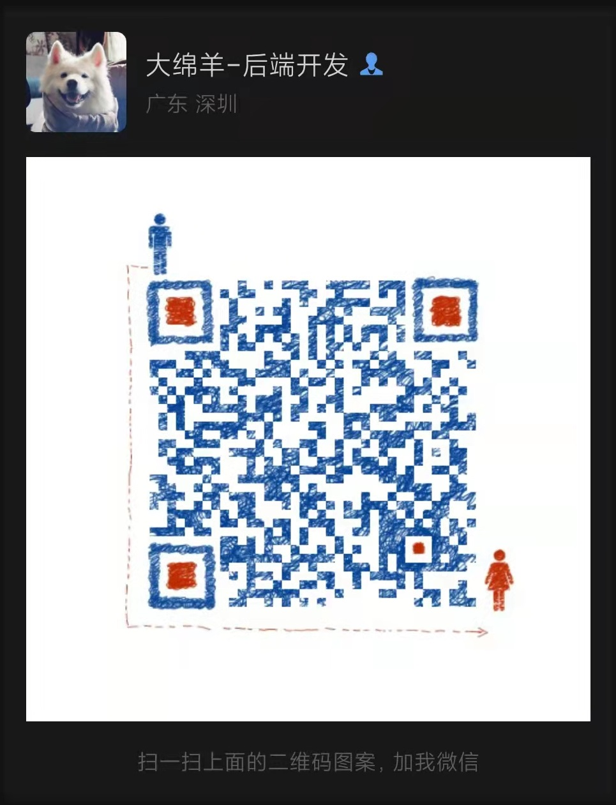
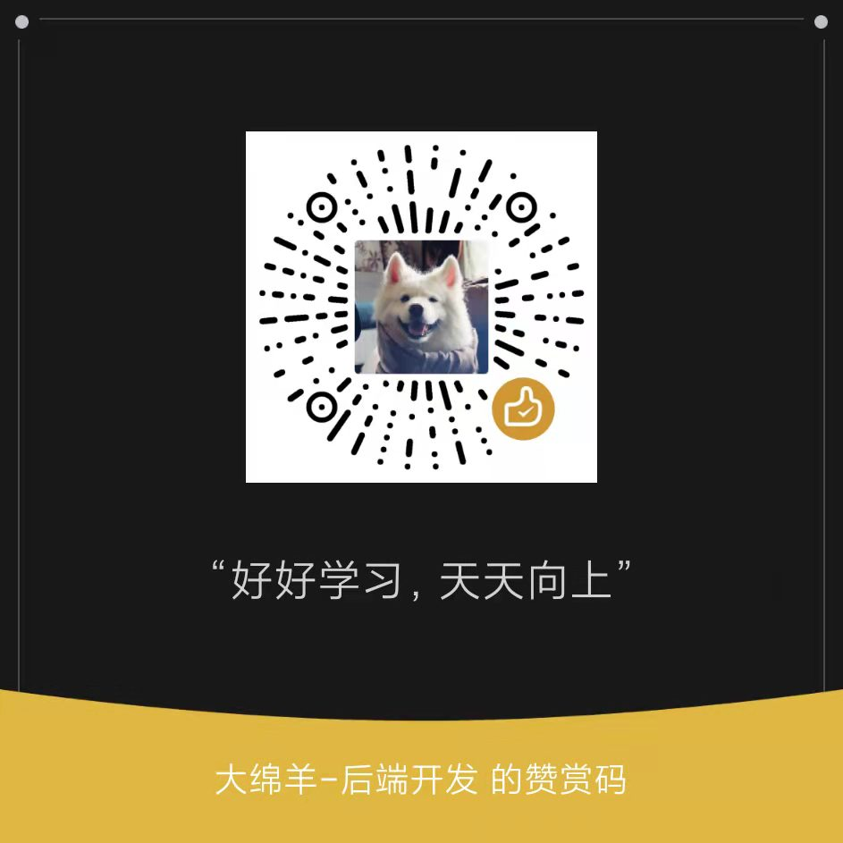

# godash - A rich, easy-to-use Golang tool library (or set of functions, methods, help classes) with detailed instructions and use cases

[简体中文](README.md) | [ENGLISH](README_EN.md)

## Usage

- Please visit [官方平台文档](https://pkg.go.dev/github.com/rbtyang/godash) for more details, Such as the description
  and usage of every package/input param/output param, and so on.

## Contributors

- I would like to thank every conscientious and selfless partner for their dedication, Thank you for your contributions
  to the open source community!

## Contact

- WeChat No: `RobotYang7` (Add me to the wechat group, Note must be "from the github")。

## Sponsor

- If the project is helpful to you, we hope to gain your positive appreciation, we will be motivated to provide more
  support!

